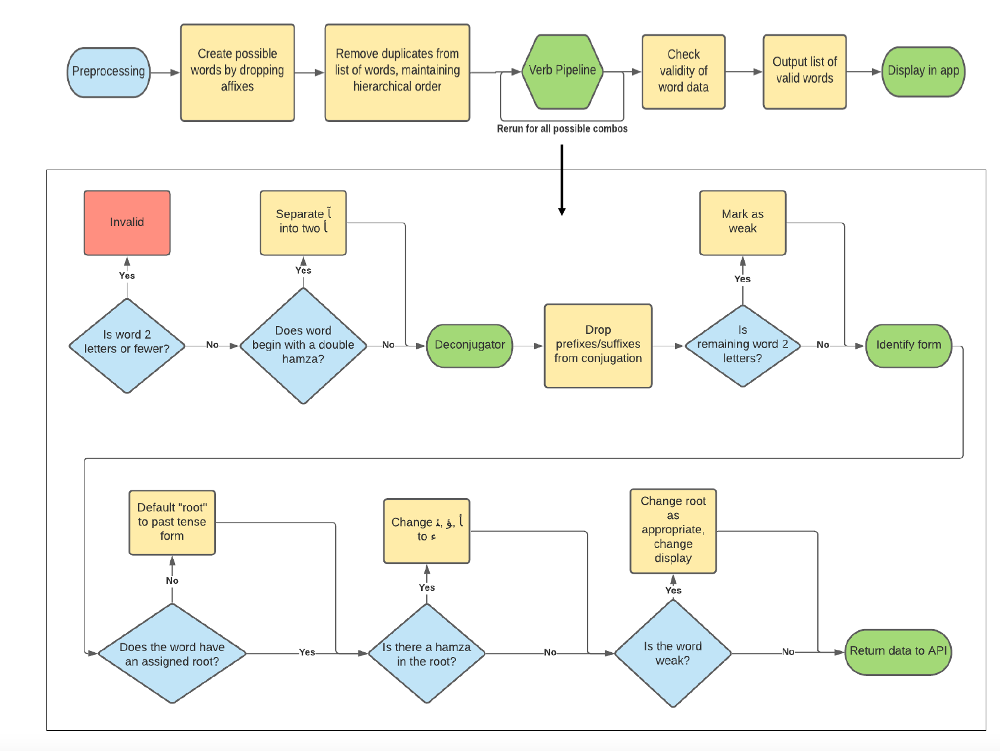
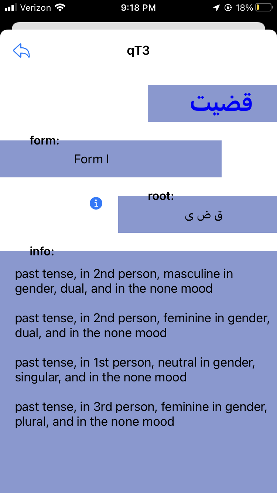
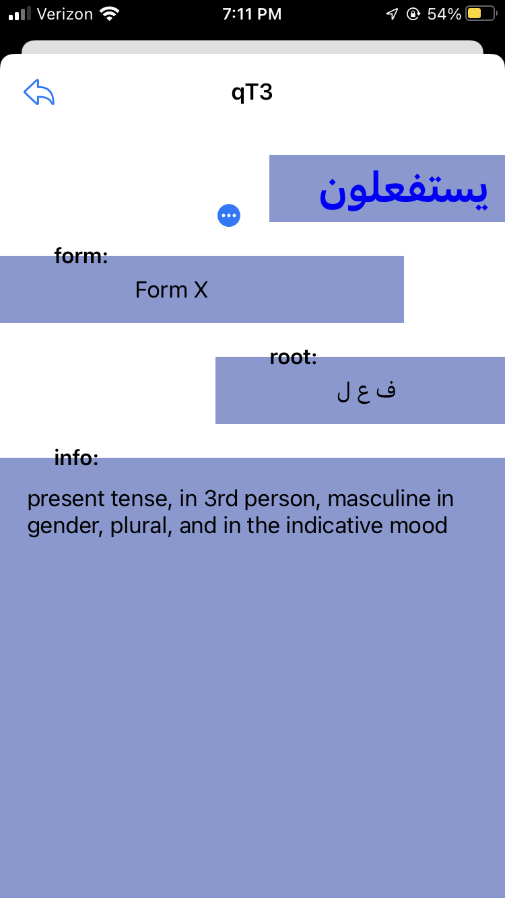

# qT3: An app for the algorithmic deduction of Arabic verbs. 

We implemented an iOS app where a user can enter an
Arabic verb in the state in which they found it: with no
short vowels, and with any prefixes and suffixes attached. In turn, they will recieve a page of information, including the root, form, and linguistic features such as tense, mood, person, and number. 

## Motivation
We were inspired by the fact that Arabic has predictable
patterns that lend itself to algorithmic deduction. As Arabic
students ourselves, we know that many resources require a
pre existing knowledge of Arabic to use. To look up a word
in an Arabic dictionary, a user must parse a given word into
a more basic form, ignore prefixes and suffixes, and identify
the root, a three letter combination that is associated with
a general core meaning. This can be difficult, especially for
beginning Arabic learners, and this difficulty only increases
with complex conjugations. Other existing technologies,
such as Google Translate provide no information other than
a rough and oft inaccurate translation. Our app fills this gap in exisiting resources, offering an application for students to be able to input a word and get the information that is most helpful to their learning and understanding of the word, and providing them the root which allows them to properly look up the word if they choose. 

## Methods

Here is a diagram walking through the methods of our algorithm. 

## Technologies

Our algorithm was implemented in Python, hosted to an API with Flask which was then deployed to Heroku, which was then accessed by our iOS application, built in Swift. The api can be accessed here: https://qt3-arabic-deduction.herokuapp.com/api/verb?id=%D8%A7%D8%B3%D8%AA%D8%B9%D9%85%D9%84 (with url form https://qt3-arabic-deduction.herokuapp.com/api/verb?id={ARABIC VERB HERE}

## Screenshots

## Tests

We tested our algorithm's correctness by implementing a test suite which includes 30 individual tests, each running multiple tests within them. 

## Status

Currently this project is in a development phase, and not ready for release on the App Store. Future work includes doing a more in-depth search for possible bugs or places where our algorithm may fail, and improving the front-end. 

#### References:
(Swift)
https://www.youtube.com/watch?v=sqo844saoC4
https://www.youtube.com/watch?v=joy9hu06J7g

(API)
https://stackabuse.com/deploying-a-flask-application-to-heroku/
https://dev.to/techparida/how-to-deploy-a-flask-app-on-heroku-heb

This link has the command I need to deploy API
https://medium.com/@shalandy/deploy-git-subdirectory-to-heroku-ea05e95fce1f

http://www.wseas.us/e-library/conferences/2011/Paris/ECC/ECC-66.pdf
https://www.naun.org/main/NAUN/ijmmas/20-805.pdf
http://www.iaeng.org/publication/WCE2013/WCE2013_pp1577-1582.pdf
